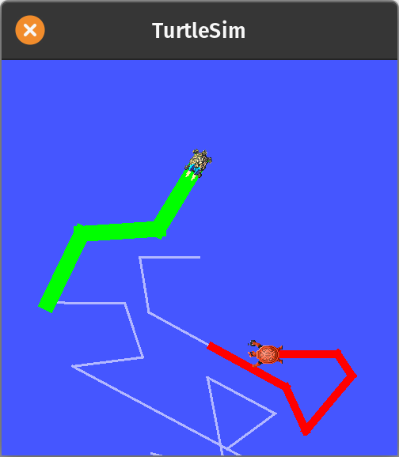
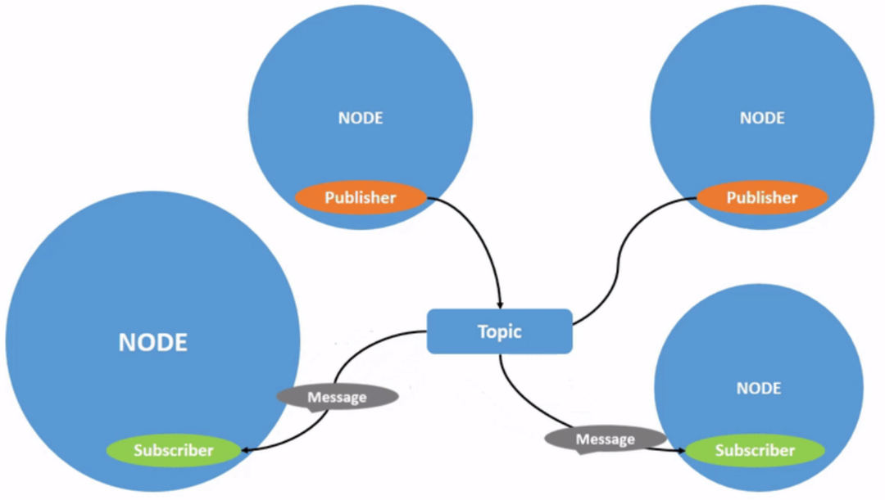

# ROS2know

These are notes dedicated to my learning ROS, the Robotic Operating System.
Note: I work exclusively with Linux.

Most if not all will be about ROS2.

# Introduction

image from [understanding-ROS2-Nodes](https://docs.ros.org/en/iron/Tutorials/Beginner-CLI-Tools/Understanding-ROS2-Nodes/Understanding-ROS2-Nodes.html)

All robots based on ROS are programmed using five simple but core constructs, and you'll hear these often:
  - Nodes
  - Parameters
  - Topics
  - Services
  - Actions

# Installation

Follow the guide [here for ros2 humble](https://docs.ros.org/en/humble/Installation/Ubuntu-Install-Debians.html) or [here for ros2 iron](https://docs.ros.org/en/iron/Installation/Ubuntu-Install-Debians.html), installation was performed using the recommended Debian packages approach.
Installation went smoothly on Ubuntu 22.04 and Pop-OS 22.04.

    sudo curl -sSL https://raw.githubusercontent.com/ros/rosdistro/master/ros.key -o /usr/share/keyrings/ros-archive-keyring.gpg
    echo "deb [arch=$(dpkg --print-architecture) signed-by=/usr/share/keyrings/ros-archive-keyring.gpg] http://packages.ros.org/ros2/ubuntu $(. /etc/os-release && echo $UBUNTU_CODENAME) main" | sudo tee /etc/apt/sources.list.d/ros2.list > /dev/null
    sudo apt update && sudo apt install ros-dev-tools
    sudo apt install ros-iron-desktop
Do this in order to not having to source the ros setup.sh in every newly opened terminal.

    echo "source /opt/ros/[the_version_most_often_used]/setup.bash" >> ~/.bashrc

`[the_version_most_often_used]`: ex. `iron` or `humble`. We can't source 2 different versions of ros so chose one version to sourceautomatically in every new shell or don't add this to .bashrc. This can be overridden by manually sourcing a different ros version.

It is possible to install different versions of ros on the same machine, even mixing ros1 and ros2. But only one can be sourced at a time in a same shell. 
See this [robotics SE post](https://robotics.stackexchange.com/questions/24180/multiple-ros-installation-on-single-machine).

The ROS environment can be seen with :

    env | grep ROS

IT will show something like:

    ROS_VERSION=2
    ROS_PYTHON_VERSION=3
    ROS_DOMAIN_ID=0
    ROS_AUTOMATIC_DISCOVERY_RANGE=SUBNET
    ROS_LOCALHOST_ONLY=0
    ROS_DISTRO=humble

The warning: `ROS_DISTRO was set to 'iron' before. Please make sure that the environment does not mix paths from different distributions.`
occurs when in the same shell a new ros version `setup.bash` was sourced. See [related info here](https://answers.ros.org/question/62589/problem-with-the-terminal-ros_distro/).

ROS domain ID:

    echo "export ROS_DOMAIN_ID=<your_domain_id>" >> ~/.bashrc

I used 0 as it seems to be the default one to have turtlesim (see next in the tutorials) to respond to keyboard commands.

# Tutorials

## turtlesim

Install the corresponding ros package and rqt utility:

    sudo apt install ros-iron-turtlesim
    sudo apt install ~nros-iron-rqt*

Open 2 terminal tabs / windows, in the first one enter:

    ros2 run turtlesim turtlesim_node

In the second:

    $ ros2 run turtlesim turtle_teleop_key

The turtle will respond to keyboard control from within the 2nd terminal window (i.e. in which the command `$ ros2 run turtlesim turtle_teleop_key` was entered), not in the turtlesim window itself!

WE'll now create a second turtle with the help of rqt.

Open a 3rd terminal tab/window, enter:

    rqt

Several 'services' should be available, go to plugins > Services > Service Caller.

In the dropdown menu select /Spawn and enter a name for a new turtle (in between the '').

The turtle may be created outside the visible area of the turtlesim window.
It should appear in the turtlesim_node terminal as:

    QImage::pixel: coordinate (0,532) out of range
    QImage::pixel: coordinate (0,532) out of range

In order to control the newly created turtle, a 'remapping' has to be done. In a 4th terminal, enter:

    ros2 run turtlesim turtle_teleop_key --ros-args --remap turtle1/cmd_vel:=turtle2/cmd_vel

This allows the control of the second turtle with the keyboard. From within that terminal, arrow keys will move the second turtle.

Change the pen color and width by opening the set_pen service from the dropdown menu, with the name of the turtle for which the pen is to be modified, ex: /turtle1/set_pen

Other services can be tried, such as TeleportAbsolute.

Always click on the Call button to execute the service.

## nodes

image from [understanding-ROS2-Topics](https://docs.ros.org/en/iron/Tutorials/Beginner-CLI-Tools/Understanding-ROS2-Topics/Understanding-ROS2-Topics.html)

ros2 node info /my_turtle

there's command completion available, pressing tab after `info ` shows the available nodes.

## ROS Topics

The tutorial can be found [here](ros2 topic echo /turtle1/cmd_vel)

Prepare 4 terminals.
In the 1st:

    ros2 run turtlesim turtlesim_node

In the 2nd:

    ros2 run turtlesim turtle_teleop_key

In the 3rd:

    rqt_graph

Then in the 4th, use a command line to list the current topics:

    ros2 topic list 

To see the data being published on a topic, use:

    ros2 topic echo <topic_name>

Since we know that /teleop_turtle publishes data to /turtlesim over the /turtle1/cmd_vel topic, let’s use echo to introspect that topic:

    ros2 topic echo /turtle1/cmd_vel

In the 2nd terminal, where the turtle_teleop_key topic is running, press the arrow keys; the result will be echoes in the 5th terminal.
# How-To

## ros bags convertions

The utility rosbags allows:
highlevel easy-to-use interfaces,

rosbag2 reader and writer,

rosbag1 reader and writer,

extensible type system with serializers and deserializers,

efficient converter between rosbag1 and rosbag2,
and more.

https://gitlab.com/ternaris/rosbags

## Gazebo installation

https://gazebosim.org/docs/harmonic/install_ubuntu

